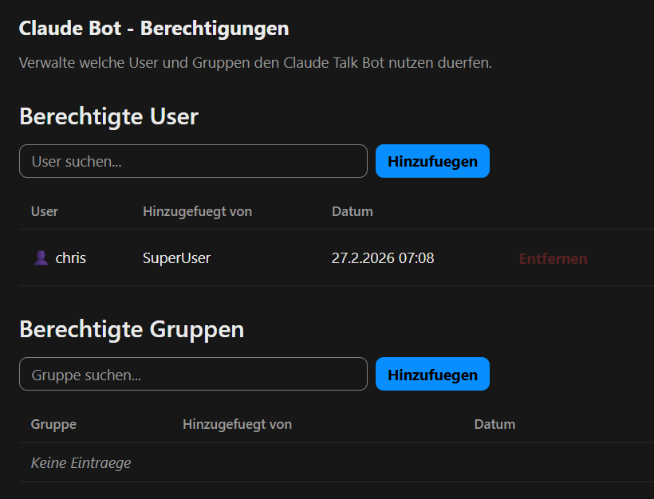

# Claude Bot — Nextcloud App + Bot Service

A complete solution for running a Claude AI assistant in Nextcloud Talk:

1. **Nextcloud App** (`claudebot/`) — Permission management UI and API
2. **Bot Service** (`bot/`) — Python daemon that connects Nextcloud Talk to Claude Code CLI

## How It Works

```
User (Talk) → NC Talk API → Bot Service → Claude Code CLI
                   ↑                ↓
              Permission ← NC App API (check)
```

1. Users send messages in Nextcloud Talk 1:1 conversations with the bot user
2. The bot service polls for new messages via long-polling
3. Before responding, it checks the permission API (provided by the NC app)
4. If allowed, the message is forwarded to Claude Code CLI
5. The response is sent back to the Talk conversation

## Nextcloud App

The app provides an admin UI and REST API for managing who can use the bot.

### Features
- **User permissions** — Allow individual users
- **Group permissions** — Allow entire groups
- **Admin UI** — Settings → Administration → Claude Bot
- **Autocomplete** — Search users/groups with Nextcloud's built-in autocomplete

### Requirements
- Nextcloud 28 — 32
- PHP 8.0+

### Installation

**From the App Store:** Search for "Claude Bot" in your Nextcloud app management.

**Manual:**
```bash
tar xzf claudebot-*.tar.gz -C /path/to/nextcloud/apps/
occ app:enable claudebot
```

### Configuration

The bot username defaults to `bot-claude`. Change it with:
```bash
occ config:app:set claudebot bot_user --value="your-bot-user"
```

## Bot Service

The Python bot runs on any server with [Claude Code CLI](https://docs.anthropic.com/en/docs/claude-code) installed.

### Requirements
- Python 3.9+
- Claude Code CLI (`claude`) installed and authenticated
- Network access to your Nextcloud instance

### Setup

1. **Create a Nextcloud user** for the bot (e.g. `bot-claude`)
2. **Copy config:**
   ```bash
   cd bot/
   cp config.example.json config.json
   ```
3. **Edit `config.json`** with your Nextcloud URL, bot credentials, and preferences
4. **Install the NC app** and add yourself to the allowed users
5. **Run the bot:**
   ```bash
   python3 claude_bot.py
   ```

### Configuration Options

| Key | Default | Description |
|-----|---------|-------------|
| `nextcloud.base_url` | — | Your Nextcloud URL |
| `nextcloud.username` | — | Bot user's username |
| `nextcloud.password` | — | Bot user's app password |
| `claude.model` | `sonnet` | Default Claude model (sonnet/opus/haiku) |
| `claude.max_response_length` | `3500` | Max response length before truncation |
| `claude.working_directory` | `$HOME` | Working directory for Claude CLI |
| `claude.max_turns` | `0` | Max agentic turns (0 = unlimited) |
| `permission_cache_ttl` | `300` | Permission cache TTL in seconds |
| `admin_users` | `[]` | Users who see extended /status info |

### Bot Commands

Users can send these commands in their Talk conversation:

| Command | Description |
|---------|-------------|
| `/clear` | Start a new Claude session |
| `/stop` | Cancel a running request |
| `/model [name]` | Show/change model (sonnet, opus, haiku) |
| `/status` | Show session info |
| `/help` | Show available commands |

### Running as a systemd Service

```bash
sudo cp claude-bot.service.example /etc/systemd/system/claude-bot.service
# Edit the service file with your paths and username
sudo systemctl enable --now claude-bot.service
```

## API Reference

All endpoints use OCS and require the header `OCS-APIRequest: true`.

### Check permission (bot user + admins)
```
GET /ocs/v2.php/apps/claudebot/api/v1/check/{userId}
→ {"ocs": {"data": {"allowed": true, "reason": "user"}}}
```

### List all permissions (admin only)
```
GET /ocs/v2.php/apps/claudebot/api/v1/permissions
```

### Add permission (admin only)
```
POST /ocs/v2.php/apps/claudebot/api/v1/permissions
{"type": "user"|"group", "target": "name"}
```

### Remove permission (admin only)
```
DELETE /ocs/v2.php/apps/claudebot/api/v1/permissions/{id}
```

## Screenshots



## License

AGPL-3.0-or-later — see [LICENSE](claudebot/LICENSE)
